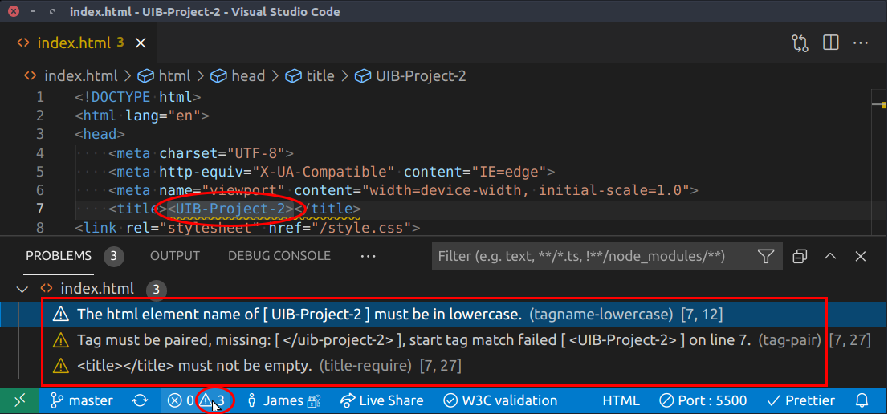
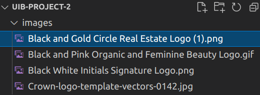
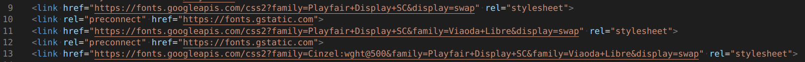

# NOTES 2021-06-23

## Appreciation
* You have chosen a black and palegold colour palette, which gives a rich feeling to the site.
* You have used advanced techniques, like `-webkit-background-clip: text;` and `transform: rotateY();`, which show off your knowledge of CSS
* You have included an animated GIF to give a subtle feeling of movement.
* Your title text is a call to action.
* You plan to include 4 more pages.

## Issues
### Creating a separate repository
You have placed your UIB-Project-2 directory inside `TravelwithMe/EXERCISES`.I think that you want to fix this. I think you want to:
1. Move the UIB-Project-2 director outside the `TravelwithMe` directory
2. `cd` into the directory in its new location
3. Run `git init`, so that it becomes a repository in its own right
4. On GitHub, create a new repository (possible called `UIB-Project-2`)
5. Copy the lines...
   ```bash
   git remote add origin git@github.com:Flaca2810/UIB-Project-2.git
   git branch -M main
   git push -u origin main
   ```
   ... from the new repository page, and execute them inside your new local repository

### Fixing the title

If you click on the little Warning Triangle icon at the bottom right of the VS Code window, you will see that there are a nember of errors in your `<title>` tag. It should be easy to fix these.

### Problems with image names

Your image names are long and contain spaces. While this is not wrong, it is better (more professional) to use short names with no spaces. The path to an image file is a URL (Universal Resource Locator), and URLs cannot contain spaces. URL encoding normally replaces a space with a plus (+) sign or with %20. Here's how one of your images will be requested from the server:

Black%20and%20Gold%20Circle%20Real%20Estate%20Logo%20(1).png

### Multiple Google Font declarations

It appears that you want to use three different Google fonts. You have five lines, three of which are redundant.

You only need lines 12 and 13.
```html
<link rel="preconnect" href="https://fonts.gstatic.com">
<link href="https://fonts.googleapis.com/css2?family=Cinzel:wght@500&family=Playfair+Display+SC&family=Viaoda+Libre&display=swap" rel="stylesheet">
```
The `preconnect` line [helps to load the fonts faster](https://developer.mozilla.org/en-US/docs/Web/HTML/Link_types/preconnect). The second line downloads all three fonts, all at the same time.

### Rotating text
You have a `<div>` element with a class of `div`, which contains your header text.
1. The class name could be more specific about what this div represents.
2. You add a border to it on `:hover`, which pushes other elements down, and that downward movement distracts the eye from the rotation.
3. You rotate through `150deg`. Did you mean that to be `180deg`?

### Responsivity
I imagine that you want to centre the rotating text, whether the viewport is wide or narrow. If I make the viewport wide, the rotating text remains on the left. If I make the page really narrow (my smartphone has a screenwidth of 360px), the rotating text is too big for the screen, and the two-word menu items wrap to the next line.

#### @media query
On line 103 of your CSS file, you have a @media query which sets the `flex-direction` for all elements with a `class` of `body`. I'm guessing that you really mean to apply this to the `<body>` element. However, you do not set the `display` of the `<body>` element to `flex`, so setting its `flex-direction` will have no effect.

#### Footer
Your body has a default margin of 8px, but your footer has a width of 100%. This makes it wider than the body and forces the browser to display a scroll bar at the foot of the page.

### CSS quirks
`auto` is not a valid value for `padding`:

87        `padding-left: auto;`

## Next steps

Perhaps you would like to make some pencil sketches of what you plan to create, or at least a written description. What will be the theme that binds the site together? What do you expect the visitor to _do_ while (or after) visiting your site?

I am guessing that you would like to showcase all the different techniques you have learned:
* links between pages
* internal links
* use of semantic elements
* box model features
* pseudo elements
* colour design
* gradients
* font effects
* icon fonts
* forms and input elements
* tables
* animations and transitions
* drop-down menus
* responsivity
* mobile-first design
* media queries
* Bootstrap
* SASS
* clip-path
* flexbox
* grid
* deploying on GitHub pages

Which of these do you enjoy using most? How can you make these techniques say good things about yourself and your web design skills?

Is this the sort of feedback that you were hoping for?

When you have a clear vision of what you would like to create, would you like to meet up with me on Zoom, with your questions on how best to proceed?
